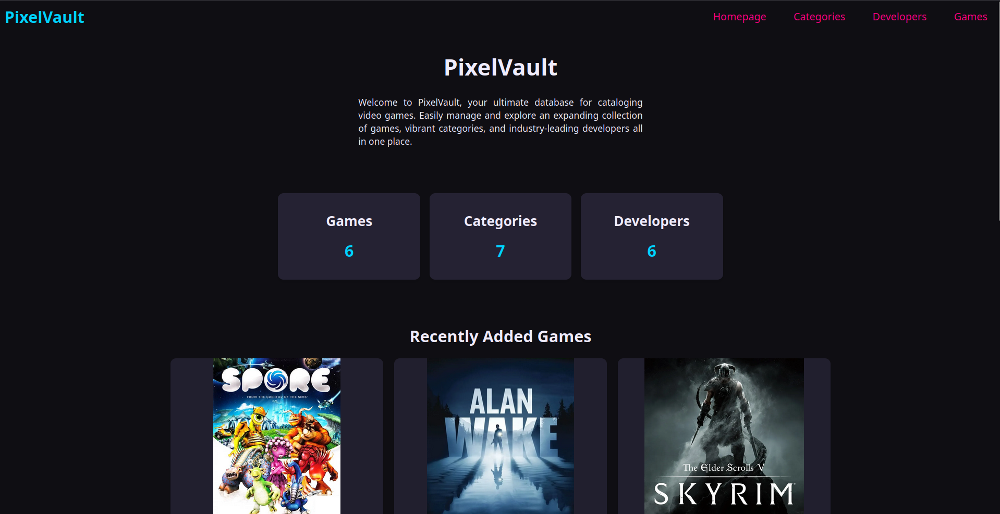
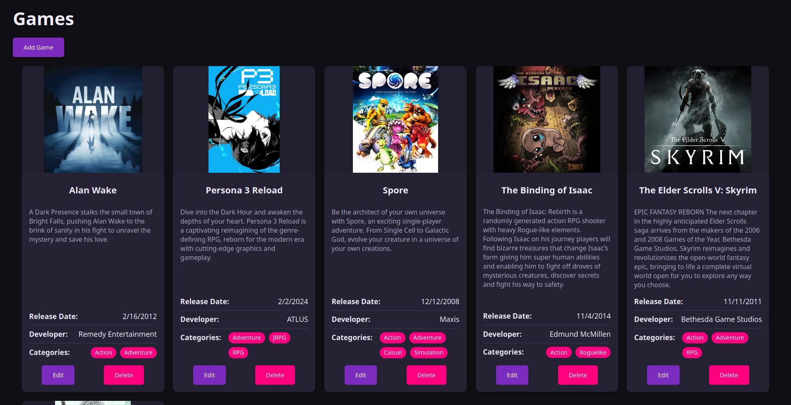
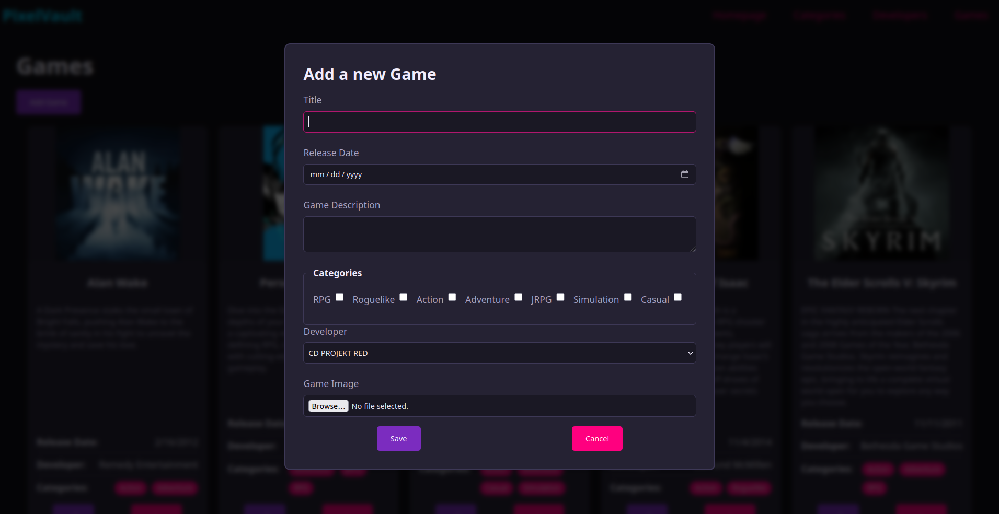

# PixelVault - Games Inventory Application

**PixelVault** is a full-stack CRUD application for cataloging and managing a video game collection. It was built specifically to fulfill the requirements of the [Inventory Application Project](https://www.theodinproject.com/lessons/node-path-nodejs-inventory-application) from The Odin Project.

The core purpose of this project is to practice creating a functional Node/Express application managing an SQL database. It challenges developers to design a database schema, populate it with records, and construct a web interface where users can comfortably Create, Read, Update, and Delete (CRUD) structured data (such as games, categories, and developers) with accurate form validation.

### 🌐 Live Demo

**[Check out the live application on Render!](https://top-inventory-application-cbxf.onrender.com/)**

⚠️ This app may take ~30 seconds to load due to free tier cold start of Render.

---

## ✨ Features

- **Full CRUD Functionality:** Create, Read, Update, and Delete games, categories, and developers.
- **Relational Database Management:** Games are stored with relational links to specific developers and multiple game categories.
- **Image Upload Integration:** Allows users to upload game cover images using `Multer`, processes them to WebP using `Sharp`, and hosts them externally via **Cloudinary**.
- **Server Validation:** Strict backend validation implemented with `express-validator` to ensure correct user input before database interactions.
- **Responsive UI:** Custom-built, responsive CSS Grid/Flexbox UI with a dark synth wave aesthetic.
- **Dynamic Server-Side Rendering:** HTML dynamically compiled using `EJS` templating to fetch real-time SQL data.

## 🛠️ Technologies Used

### Backend

- **Node.js** & **Express.js:** Server architecture and routing.
- **PostgreSQL** & **pg (node-postgres):** Relational database and querying.
- **Multer:** Handling `multipart/form-data` for image uploads.
- **Sharp:** Image optimization and format conversion.
- **Cloudinary:** Cloud-based image hosting and delivery.
- **express-validator:** Data sanitization and verification.

### Frontend

- **EJS:** Server-side template rendering.
- **HTML5 & CSS3:** Semantic markup and custom styling (Grid, Flexbox, Custom Variables).
- **Vanilla JavaScript:** Form submission overrides, dialog modals, and API fetches.

---

## 📸 Screenshots

### The Homepage

### The Games Library

### Adding a Game

### Developers

---

## 👨‍💻 Author

Created by **Pablo (yaoming16)**

- **GitHub:** [@yaoming16](https://github.com/yaoming16)
- **Repository:** [TOP-Inventory-Application](https://github.com/yaoming16/TOP-Inventory-Application)
